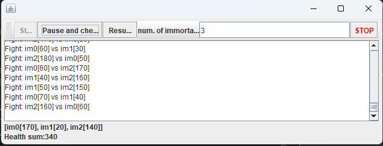

# Resolución Laboratorio 1

## Tabla de Contenido
1. [Integrantes](#integrantes)
2. [Introducción](#introducción)
3. [Procedimiento](#procedimiento)
    1. [Parte I](#Parte-i)
    2. [Parte II](#parte-ii)
    3. [Parte III](#parte-iii)
5. [Conclusiones](#conclusiones)

---

## Integrantes
- Santiago Avellaneda
- Miguel Motta

---

## Introducción
Este informe detalla cómo abordamos un ejercicio práctico en el curso de 
Arquitecturas de Software, en el que nos adentramos en los conceptos clave 
de la programación concurrente, el manejo de condiciones de carrera y la 
sincronización de hilos en Java. 

El ejercicio se divide en tres partes: 

* Comenzamos con la implementación básica de un modelo productor-consumidor, 
utilizando técnicas como wait y notify para controlar los hilos.
* Luego, implementamos las clases de cola con manejo de hilos, para aprovechar
sus funcionalidades y el manejo que tienen de recursos de hilos.
* Finalmente, avanzamos hacia la resolución de problemas de sincronización más complejos 
en un simulador de inmortales que opera con múltiples hilos. 

A lo largo de estas actividades, nuestro objetivo ha sido optimizar el rendimiento de 
los programas, gestionando eficientemente el uso de la CPU, abordando 
adecuadamente las condiciones de carrera y aplicando estrategias de 
bloqueo para prevenir posibles deadlocks. Por último, analizaremos cómo 
se comporta el sistema en escenarios más grandes, evaluando cómo nuestras 
soluciones impactan en el rendimiento y la consistencia del programa.

---

## Procedimiento

---

### Parte I
> 
> 1. Revise el funcionamiento del programa y ejecútelo. Mientras esto ocurren, ejecute
     jVisualVM y revise el consumo de CPU del proceso correspondiente. A qué se debe este
     consumo?, cuál es la clase responsable?

> 2. Haga los ajustes necesarios para que la solución use más eficientemente la CPU,
   teniendo en cuenta que -por ahora- la producción es lenta y el consumo es rápido.
   Verifique con JVisualVM que el consumo de CPU se reduzca.
 
> 3. Haga que ahora el productor produzca muy rápido, y el consumidor consuma lento.
   Teniendo en cuenta que el productor conoce un límite de Stock (cuantos elementos
   debería tener, a lo sumo en la cola), haga que dicho límite se respete. Revise
   el API de la colección usada como cola para ver cómo garantizar que dicho límite
   no se supere. Verifique que, al poner un límite pequeño para el 'stock', no haya
   consumo alto de CPU ni errores.


### Solución
> #### Punto 1
> 
> Las clases responsables del consumo de CPU es debido a la continua ejecución de las clases 
> [`Producer`](src/main/java/edu/eci/arst/concprg/prodcons/Producer.java),
> [`Consumer`](src/main/java/edu/eci/arst/concprg/prodcons/Consumer.java)
> que están haciendo uso de un recurso compartido de producción y consumo.
> 
> La clase principal que mantiene el control de esta ejecución es la clase
> [`Start Production`](src/main/java/edu/eci/arst/concprg/prodcons/StartProduction.java)
> Permitiendo la producción de recursos por un periodo de 5 segundos.
> 
> Las clases
> [`Producer`](src/main/java/edu/eci/arst/concprg/prodcons/Producer.java),
> [`Consumer`](src/main/java/edu/eci/arst/concprg/prodcons/Consumer.java)
> comparten la responsabilidad de ejecución, sin embargo, no se está haciendo un
> uso óptimo de los recursos como podremos apreciar en su ejecución:
> 
> 
> 

> #### Punto 2
> Para reducir el tiempo de uso innecesario de CPU, nuestra estrategia fue 
> bloquear los hilos dependiendo de su actividad evaluando su capacidad de ejecución,
> es decir, dependiendo de su actividad y los recursos disponibles, los hilos se bloquean
> hasta que puedan seguirse ejecutando. ¿Cómo podemos hacer esto?
> 
> La solución es implementar una clase [_Thread-safety_](https://www.baeldung.com/java-thread-safety)
> que esté enfocada a una estructura de pila o cola de datos, como lo es la clase [LinkedBlockingQueue](https://docs.oracle.com/javase/8/docs/api/java/util/concurrent/LinkedBlockingQueue.html).
> 
> Esta clase nos permite manejar un comportamiento similar a la solución que buscamos, 
> con los métodos `take()` y `put()` que pausan sus hilos en caso de no haber elementos en la pila, o que 
> se halla excedido el tamaño de la cola y no se puedan agregar más elementos.
> 
> Primero usamos el método `take()` en lugar de `poll()`, dado que la actividad de consumo se presenta con mayor frecuencia y, en consecuencia
> el hilo está ocioso un mayor periodo de tiempo, lo que es ineficiente. 
> De esta manera, pudimos reducir considerablemente el uso de CPU, de aproximadamente un 6% a un 0.1%:
> 
>  

> #### Punto 3
> Para resolver este punto, mantuvimos los cambios del anterior punto, y adicionalmente, implementamos 
> el método `put()` en lugar de `add()` para que se ejecute siempre que haya espacio en la cola de elementos, de lo
> contrario bloquea el hilo hasta que haya espacio en la cola.
> 
> Esta implementación permitió reducir el procesamiento considerablemente:
> 
> 

#### Parte II
> Teniendo en cuenta los conceptos vistos de condición de carrera y sincronización, haga una nueva 
> versión -más eficiente- del ejercicio anterior (el buscador de listas negras). En la versión 
> actual, cada hilo se encarga de revisar el host en la totalidad del subconjunto de servidores 
> que le corresponde, de manera que en conjunto se están explorando la totalidad de servidores. 
> Teniendo esto en cuenta, haga que:
> 
> * La búsqueda distribuida se detenga (deje de buscar en las listas negras restantes) y retorne 
> la respuesta apenas, en su conjunto, los hilos hayan detectado el número de ocurrencias 
> requerido que determina si un host es confiable o no (BLACK_LIST_ALARM_COUNT).
> 
> * Lo anterior, garantizando que no se den condiciones de carrera.
## Solución

> Para resolver este problema, implementamos una clase que extiende de `Thread` que utiliza elementos
> Thread-Safety para gestionar el número de IP's encontradas en la `Blacklist`, estas a su vez se generan concurrentemente
> de forma aleatoria, garantizando que la `Blacklist` también contenga algunas de estas IP's, dependiendo del valor que se especifique.
> 
> #### Clase [`BlackListChecker`](src/main/java/edu/eci/arso/blacklist/BlackListChecker.java)
> 
> ```java
> public class BlackListChecker extends Thread {
>    private AtomicInteger unsecureDirections = new AtomicInteger(0);
>    private final CountDownLatch latch;
>     public static int BLACK_LIST_ALARM_COUNT;
>    private List<String> blackList;
>    private List<String> directionsToCheck;
>    private final int NUMBER_THREADS;
>    private List<Checker> checkers;
>    private AtomicBoolean isInsecure = new AtomicBoolean(false);
>  }
> ```
> 
> Esta clase tiene la responsabilidad de analizar una lista de direcciones comparándola con la `BlackList`
> Lo hace segmentando la lista completa en el número de hilos dados para hacerlo concurrentemente, además,
> con la implementación de un elemento de tipo [`CountDownLatch`](https://docs.oracle.com/javase/8/docs/api/java/util/concurrent/CountDownLatch.html)
> Podemos esperar a que los hilos que poseen ese `latch` terminen y a continuación prosiga con la ejecución del hilo.
> 
> ```java
> public class BlackListChecker extends Thread {
>    // Attributes
>    // Constructor
>    // Methods
>    @Override
>    public void run() {
>        int chunkSize = directionsToCheck.size() / NUMBER_THREADS;
>        for (int i = 0; i < NUMBER_THREADS; i++) {
>            int start = i * chunkSize;
>            int end = (i + 1) * chunkSize;
>            if (i == NUMBER_THREADS - 1) {
>                end = directionsToCheck.size();
>            }
>            Checker checker = new Checker(blackList, directionsToCheck.subList(start, end), unsecureDirections, isInsecure, latch);
>            checkers.add(checker);
>            checker.start();
>        }
>        try {
>            latch.await();
>        } catch (InterruptedException e) {
>           Thread.currentThread().interrupt();
>           e.printStackTrace();
>        }
>        System.out.println("Finished...");
>        System.out.println("Found " + unsecureDirections.get() + " unsecure directions.");
>   }
> }
> ```
> 
> 
> #### Clase [`Checker`](src/main/java/edu/eci/arso/blacklist/Checker.java)
> ```java
> public class Checker extends Thread {
>    private final CountDownLatch latch;
>    private AtomicInteger unsecureDirectionsFound;
>    private List<String> blackList;
>    private List<String> directionsToCheck;
>    private AtomicBoolean isInsecure;
> }
> ```
> 
> Esta clase hace uso del objeto de control [`CountDownLatch`](https://docs.oracle.com/javase/8/docs/api/java/util/concurrent/CountDownLatch.html)
> para gestionar el ciclo de vida del hilo de manera eficiente. Además, se implementa un booleano y un entero de tipo
> [`AtomicBoolean`](https://docs.oracle.com/javase/8/docs/api/java/util/concurrent/atomic/AtomicBoolean.html)
> [`AtomicInteger`](https://docs.oracle.com/javase/8/docs/api/java/util/concurrent/atomic/AtomicInteger.html)
> respectivamente, de modo que se pueda mantener información compartida de manera concurrente y garantizar que esos
> valores no presentarán condiciones de carrera.
> 
> La estrategia implementada en la clase está basada en la revisión de la lista en el hilo,
> si se tiene que el número de IP's encontradas es igual o mayor al número de listas
> permitidas, se detiene el hilo. Lo que garantiza que el número de ocurrencias de IP's maliciosas
> es la misma para todos los hilos, es que el objeto `unsecureDirectionsFound` lo comparten todos los hilos de tipo `Checker`:
> ```java
> public class Checker extends Thread {
>      @Override
>      public void run() {
>          for (String direction : directionsToCheck) {
>              if (isInsecure.get()) {
>                  System.out.println("Stopping thread...");
>                  latch.countDown();
>                  return;
>              }
>              if (blackList.contains(direction)) {
>                  System.out.println(this.getName() + " Found insecure direction: " + direction);
>                  unsecureDirectionsFound.incrementAndGet();
>                  if (unsecureDirectionsFound.get() >= BlackListChecker.BLACK_LIST_ALARM_COUNT) {
>                      isInsecure.set(true);
>                      System.out.println("Stopping thread...");
>                      latch.countDown();
>                      return;
>                  }
>              }
>          }
>          latch.countDown();
>      }
>  }
> ```
> 
> Finalmente, la clase `StartChecker`, implementa la búsqueda de la clase
> [`BlackListChecker`](src/main/java/edu/eci/arso/blacklist/BlackListChecker.java)
> y genera las listas de IP objeto del análisis. 
> 
> Para hacer este procedimiento más eficiente, la generación de listas de IP se hace de manera 
> concurrente con la clase [`ConcurrentIPGenerator`](src/main/java/edu/eci/arso/blacklist/ConcurrentIPGenerator.java)
> con la misma estrategia, de dividir el trabajo y esperar a que los hilos terminen en la creación de la lista.
> 
#### Parte III
> 
> Sincronización y Dead-Locks.
> 
> 
> 
> 1. Revise el programa “highlander-simulator”, dispuesto en el paquete edu.eci.arsw.highlandersim. Este es un juego en el que:
> 
>    * Se tienen N jugadores inmortales.
>    * Cada jugador conoce a los N-1 jugador restantes.
>    * Cada jugador, permanentemente, ataca a algún otro inmortal. El que primero ataca le resta M puntos de vida a su contrincante, y aumenta en esta misma cantidad sus propios puntos de vida.
>    * El juego podría nunca tener un único ganador. Lo más probable es que al final sólo queden dos, peleando indefinidamente quitando y sumando puntos de vida.
> 
> 2. Revise el código e identifique cómo se implementó la funcionalidad antes indicada. Dada la intención del juego, un invariante debería ser que la sumatoria de los puntos de vida de todos los jugadores siempre sea el mismo(claro está, en un instante de tiempo en el que no esté en proceso una operación de incremento/reducción de tiempo). Para este caso, para N jugadores, cual debería ser este valor?.
> 
> 3. Ejecute la aplicación y verifique cómo funcionan la opción ‘pause and check’. ¿Se cumple el invariante?.
> 
> 4. Una primera hipótesis para que se presente la condición de carrera para dicha función (pause and check), es que el programa consulta la lista cuyos valores va a imprimir, a la vez que otros hilos modifican sus valores. Para corregir esto, haga lo que sea necesario para que efectivamente, antes de imprimir los resultados actuales, se pausen todos los demás hilos. Adicionalmente, implemente la opción ‘resume’.
> 
> 5. Verifique nuevamente el funcionamiento (haga clic muchas veces en el botón). ¿Se cumple o no el invariante?.
> 
>    6. Identifique posibles regiones críticas en lo que respecta a la pelea de los inmortales. Implemente una estrategia de bloqueo que evite las condiciones de carrera. Recuerde que si usted requiere usar dos o más ‘locks’ simultáneamente, puede usar bloques sincronizados anidados:
> 
>       ```java
>        synchronized(locka){
>            synchronized(lockb){
>                …
>            }
>        }
>        ```
> 
> 7. Tras implementar su estrategia, ponga a correr su programa, y ponga atención a si este se llega a detener. Si es así, use los programas jps y jstack para identificar por qué el programa se detuvo.
>    
> 8. Plantee una estrategia para corregir el problema antes identificado (puede revisar de nuevo las páginas 206 y 207 de _Java Concurrency in Practice_).
>    
> 9. Una vez corregido el problema, rectifique que el programa siga funcionando de manera consistente cuando se ejecutan 100, 1000 o 10000 inmortales. Si en estos casos grandes se empieza a incumplir de nuevo el invariante, debe analizar lo realizado en el paso 4.
>    
> 10. Un elemento molesto para la simulación es que en cierto punto de la misma hay pocos 'inmortales' vivos realizando peleas fallidas con 'inmortales' ya muertos. Es necesario ir suprimiendo los inmortales muertos de la simulación a medida que van muriendo. Para esto:
>    * ¿Analizando el esquema de funcionamiento de la simulación, esto podría crear una condición de carrera? Implemente la funcionalidad, ejecute la simulación y observe qué problema se presenta cuando hay muchos 'inmortales' en la misma. Escriba sus conclusiones al respecto en el archivo RESPUESTAS.txt.
>    * Corrija el problema anterior __SIN hacer uso de sincronización__, pues volver secuencial el acceso a la lista compartida de inmortales haría extremadamente lenta la simulación.
>      
> 11. Para finalizar, implemente la opción STOP.
## Solución
> Esta implementación, inicialmente, se llevó a cabo con la siguiente estrategia: 
> 1. Se Crean los luchadores de acuerdo al número ingresado de luchadores, que por defecto son 3.
> 2. Se inicializan esos luchadores `inmortales`.
> 3. Un inmortal peleará continuamente a menos que su vida sea menor a cero, de lo contrario
> Reportará que ha sido eliminado (pero continuará en ejecución).

> La invariante de la sumatoria de los puntos de vida, debería ser el mismo valor en todo momento,
> además, si se tiene que los luchadores comparten la misma cantidad de daño y la misma cantidad de vida
> inicialmente, y estos valores no cambian. La invariante de la sumatoria de vida de todos los jugadores, siendo 
> N jugadores, está dada por la expresión:
> $$ Invariante = (\text{Vida inicial}) \times N $$
> En este caso tenemos que la vida inicial es 100, entonces:
> $$ Invariante = 100 \times N $$
> 

> Al ejecutar la aplicación, se evidencia que la invariante no se mantiene:
> 
>  
> #### Valor de invariante: `340`
> 
> Y Sigue cambiando:
> 
> 
> #### Valor de invariante: `1540`
> 
> De modo que no se cumple la invariante. 
>

> Para implementar un bloqueo en los hilos, lo hicimos de la siguiente manera:
> 1. Implementamos un estado en el controlador, esto para que esta clase controle desde un atributo de estado
> el estado de ejecución de los hilos, usando un objeto de tipo 
> [`AtomicBoolean`](https://docs.oracle.com/javase/8/docs/api/java/util/concurrent/atomic/AtomicBoolean.html) y
> un objeto monitor, que permite controlar los hilos de 
> [`Immortal`](src/main/java/edu/eci/arsw/highlandersim/Immortal.java)
> 2. Agregar una condición que hace la verificación del estado en el hilo de tipo
> [`Immortal`](src/main/java/edu/eci/arsw/highlandersim/Immortal.java) y lo detiene si el estado del controlador
> en pausa es verdadero.
> ### En clase [`Immortal`](src/main/java/edu/eci/arsw/highlandersim/Immortal.java)
> ```java
> public class Immortal extends Thread{
> // Added the attributes:
> private ControlFrame controller;
> private final Object monitor;
> @Override
>   public void run() {
>       while (true) {
>           // Added the check of controller state (with the AtomicBoolean)
>           while (controller.isPaused()){
>               synchronized (monitor){
>                   try{
>                       monitor.wait();
>                   } catch (InterruptedException e) {
>                       Thread.currentThread().interrupt();
>                       e.printStackTrace();
>                   }
>               }
>           }
>         // Continues the process
>        }
>     }
>  }
> ```
> 
> ### En clase `ControlFrame`
> ```java
>  public class ControlFrame extends JFrame {
>     // Added the attributes
>     private static AtomicBoolean paused;
>     private final Object monitor;
> 
>     // Modified the methods to pause and resume the threads:
>     btnResume.addActionListener(new ActionListener() {
>            public void actionPerformed(ActionEvent e) {
>                /**
>                 * IMPLEMENTAR
>                 */
>                synchronized (monitor){
>                    paused.set(false);
>                    monitor.notifyAll();
>                }
>            }
>        });
>     btnPauseAndCheck.addActionListener(new ActionListener() {
>            public void actionPerformed(ActionEvent e) {
>                /* COMPLETAR */
>                paused.set(true);
>                int sum = 0;
>                for (Immortal im : immortals) {
>                    sum += im.getHealth();
>                }
>                statisticsLabel.setText("<html>"+immortals.toString()+"<br>Health sum:"+ sum);
>            }
>        });
> 
>  }
> ```
> #### El resultado fue:
> 
> 
> 
> 
> 
> #### De modo que la invariante aún no se cumple.
> 

### Criterios de evaluación
> #### Diseño:
> - Coordinación de hilos:
>   - Para pausar la pelea, se debe lograr que el hilo principal induzca a los otros a que se suspendan a sí mismos. Se debe también tener en cuenta que sólo se debe mostrar la sumatoria de los puntos de vida cuando se asegure que todos los hilos han sido suspendidos.
>   - Si para lo anterior se recorre a todo el conjunto de hilos para ver su estado, se evalúa como R, por ser muy ineficiente.
>   - Si para lo anterior los hilos manipulan un contador concurrentemente, pero lo hacen sin tener en cuenta que el incremento de un contador no es una operación atómica -es decir, que puede causar una condición de carrera- , se evalúa como R. En este caso se debería sincronizar el acceso, o usar tipos atómicos como AtomicInteger).
>
> #### Consistencia ante la concurrencia 
>     * Para garantizar la consistencia en la pelea entre dos inmortales, se debe sincronizar el acceso a cualquier otra pelea que involucre a uno, al otro, o a los dos simultáneamente:
>     * En los bloques anidados de sincronización requeridos para lo anterior, se debe garantizar que si los mismos locks son usados en dos peleas simultánemante, éstos será usados en el mismo orden para evitar deadlocks.
>     * En caso de sincronizar el acceso a la pelea con un LOCK común, se evaluará como M, pues esto hace secuencial todas las peleas.
>     * La lista de inmortales debe reducirse en la medida que éstos mueran, pero esta operación debe realizarse SIN sincronización, sino haciendo uso de una colección concurrente (no bloqueante).
> 
>	
> 
>  * Funcionalidad:
>      * Se cumple con el invariante al usar la aplicación con 10, 100 o 1000 hilos.
>      * La aplicación puede reanudar y finalizar(stop) su ejecución.
> 


## Conclusiones
Durante el desarrollo de este informe, aprendimos a aplicar los principios 
clave de la programación concurrente y la sincronización de hilos en entornos 
multi-hilo. En la primera parte, nos enfocamos en optimizar el uso de la CPU, 
lo que resultó fundamental para mejorar la eficiencia del sistema al hacer 
que los hilos productores y consumidores trabajaran de manera más equilibrada 
sin sobrecargar la cola compartida. En la segunda parte, implementar 
correctamente la sincronización nos ayudó a evitar problemas de condiciones 
de carrera y a asegurar que los hilos se detuvieran adecuadamente al cumplir 
con el número establecido de resultados en nuestra búsqueda distribuida. 

Finalmente, al simular inmortales, logramos identificar y solucionar 
varios problemas relacionados con los bloqueos y la actualización 
de la lista de inmortales activos. A pesar de los retos de manejar múltiples 
hilos en simulaciones a gran escala, conseguimos mantener la consistencia del 
programa y aumentar su velocidad sin incurrir en sincronizaciones pesadas. 
En resumen, esta experiencia nos brindó una comprensible visión de cómo 
gestionar la concurrencia en aplicaciones complejas y aplicar técnicas 
de sincronización que garanticen un funcionamiento eficiente y correcto.